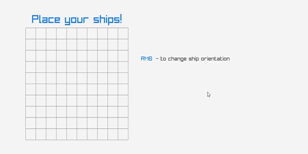
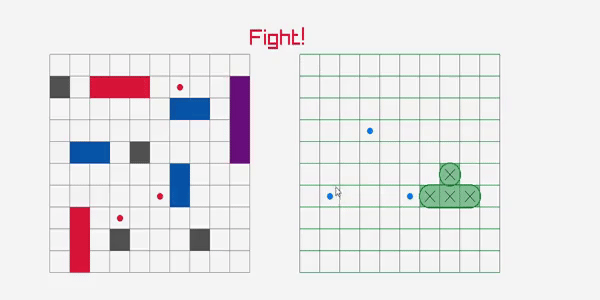
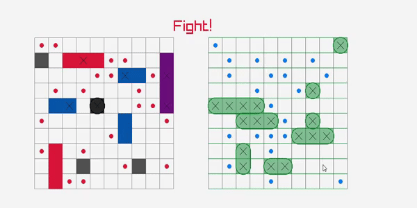

# Battleship Game (C++ / Raylib)
A mine representaion on the classic Battleship game, built in C++ with Raylib for rendering and CMake for build automation.
Includes core game logic, interactive UI, and robust unit tests using Catch2

# Features
- 🎮 Two-player turn-based gameplay: Human vs AI
- 🤖 AI ship placement and attack using randomization
- 🟢 Rendering, UI, visuals (hits,misses, destroyed ships) with Raylib
- 🧪 Unit tests with Catch2
- 🧱 Modular OOP structure: Board, Player, Ship, Renderer, GameRules
- 📁 Clean folder structure and CMake build automation
    ## Manual Ship placement mechanic
  

  ## Core Fight Gameplay
  

  
  
## How to run the game 🕹
1) You can install on your computer using: 
BattleShip-0.1.1-win64.exe
#### OR
2) You can simply clone and run cmake build commands:
 - cmake -S. -B ./build
 - cmake --build ./build
 - open a MainExecutable.exe in : Battleship\install\bin\MainExecutable.exe

##
## How to run the tests 🧪
1. Clone repository, open command console in downloaded repo
2. Run these commands: 
 - cmake -S . -B ./build
 - cmake --build ./build
 - ctests --test-dir ./build/tests --verbose
 ### OR 
You can see tests are always running after succesfull build and compilation of the program! 
##
## Project structure📂:

Battleship/

├── assets            # Materials for README.md

├── external          #External libraries source files  

├── instal/       # Game Instalation package

#### ├── source/

│   ├── core/         # Game logic (Board, Ship, Player)

│   ├── render/       # Raylib rendering code

│   └── app/      # Game entry point

#### ├── tests/            # Catch2 unit tests

├── CMakeLists.txt    # Build configuration

└── README.md         # This file

##
🤓☝️ It's my third small game project, where this time I used newly obtained skills such as:
- Raylib:	Rendering and UI
- Catch2:	Unit testing for core methods of the game
- CMake:	Automation for building the program together (Windows)
- Git:	From the start to final steps the program files had been tracking and deployed using Git Version control
